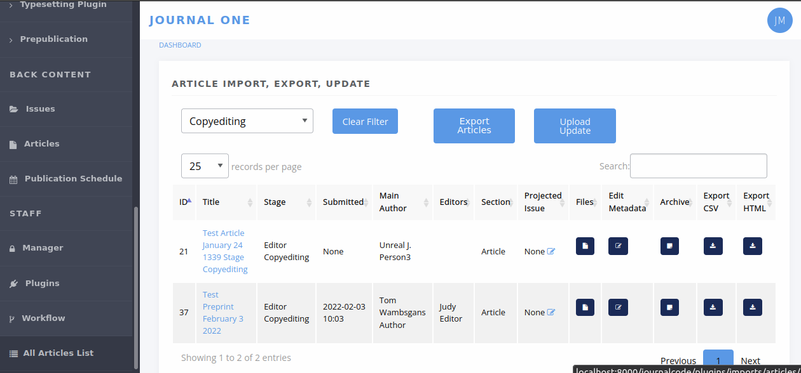

Import, Export, Update
======================

The Import / Export / Update tool lets you perform some batch actions in Janeway. You can import and export article metadata and files, and you can update some fields of existing articles.

    The Import, Export, Update start page

Importing
---------
With this tool, you can create new articles in Janeway and load them directly into the desired workflow stage (peer review, copyediting, typesetting, or prepublication).

1. Download a copy of the :download:`metadata template <_static/metadata_template.csv>` and open it up to edit it. You can use most spreadsheet applications, but make sure you will be able to save it as a CSV with UTF-8 character encoding. [#]_

2. Enter the metadata, one article per row. See the `Metadata Field Reference`_ and the :download:`sample import <_static/sample_import.csv>` for pointers. For multi-author articles, insert a new row for each author, and only fill in the author fields on extra rows.

3. Save the file with a name of your choosing.

4. From the journal's dashboard, navigate to **All Articles** under **Staff** in the lower left. You need to have 'staff' access to view this page. (The tool also appears as **Article Import, Export, Update** in the Imports plugin start page.)

5. Select **Upload Update** and upload your file. (It says 'update', but this is how you import new things too.)

6. A table should load in your browser showing you the data, before you import it. If everything looks good, select **Import**.

.. tip::
    Are you importing articles that have no authors? Leave all of these fields blank: 
      - Author salutation
      - Author given name
      - Author middle name
      - Author surname
      - Author suffix
      - Author institution
      - Author department
      - Author biography
      - Author email
      - Author ORCID
      - Author is corporate (Y/N)

Other text

Exporting
---------

You can export a CSV containing metadata for all the articles currently in a given workflow stage. It will also download selected files from that stage.

1. From the journal's dashboard, navigate to **All Articles** under **Staff** in the lower left. You need to have 'staff' access to view this page.

2. Use the **Filter by Stage** drop-down menu to choose a set of articles you want to export.

3. If you want to download associated files, use the **Files** column to add files for each article.

4. Select **Export All** or **Export Filtered**. A zip file should be downloaded containing the metadata in ``article_data.csv`` and the article files in subfolders numbered by article ID.

Updating
--------

You can update metadata for batches of articles in Janeway, so you don't have to click through each individual article to make the change.

1. To update one field, you have to provide data for all the fields, or at least most of them, because the tool interprets empty fields literally, and will save empty fields (potentially overwriting older data). So we recommend you first export the set of articles, and use that as the basis for changes. See `Exporting`_.

.. warning::
    The tool will let you overwrite old data if you leave fields blank, so make sure you start any update project by running an export.

2. Extract the zip file you exported and open the CSV in your spreadsheet software of choice (but be careful with character encoding).

3. Edit the metadata as desired. You an rearrange the columns but the column names have to stay exactly the same. See the :download:`sample update <_static/sample_update.csv>`, which shows changes made to the data in :download:`sample import <_static/sample_import.csv>`. See also the `Metadata Field Reference`_ for details on each field.

4. Save the CSV file with a name of your choosing.

5. On the **All Articles** page, select **Upload Update** and upload your CSV file.

6. A table should load in your browser showing you the data you uploaded, so you can look it over before importing it. If everything looks good, select **Import**.

Metadata Field Reference
------------------------

The table below shows you what actions (i.e. import, export, update) you can perform with each field (yes/no). For example, you can't *import* article IDs, because Janeway assigns them for you to make sure they're unique. But you can (must) use article IDs during the update process, so Janeway can recognize the articles.

Much the same, while you can put something in Stage to send the content to the right part of Janeway on initial import, you can't subsequently *update* the workflow stage for articles already in the system, because it might break editor or author tasks in progress.

The table also shows which fields you have to provide during imports and updates, regardless of whether you are changing those fields. For example, when you're importing new articles, you have to provide article titles. You also have to provide article titles when you are updating articles, even if you're not updating the titles but something else, like the keywords.

========================= =================================== ================= ================= ======================================
Field                     Notes                               Import            Export            Update
========================= =================================== ================= ================= ======================================
Janeway ID                controlled and assigned by Janeway  no, will break    yes               yes, required [#]_
Article title             include subtitle                    yes, required     yes               yes, required
Article abstract          use HTML tags for italics           yes, optional     yes               yes, optional, saves empty values
Keywords                  separate keywords with commas       yes, optional     yes               yes, optional, saves empty values
Rights                    Rights statement (free text)        yes, optional     yes               yes, optional, saves empty values
Licence                   name of licence [#]_                yes, optional     yes               yes, optional, saves empty values
Language                  name of language or ISO code [#]_   yes, optional     yes               yes, optional, saves empty values
Peer reviewed (Y/N)       Y or N                              yes, optional     yes               yes, optional, saves empty values
Author salutation         useful in templated emails          yes, optional     yes               no, ignored
Author given name         a.k.a. first name                   yes, optional     yes               yes, optional, saves empty values
Author middle name        or middle initial                   yes, optional     yes               yes, optional, saves empty values
Author surname            a.k.a. last name or family name     yes, optional     yes               yes, optional, saves empty values [#]_
Author suffix             e.g: 'Jr.' or 'III'                 yes, optional     yes               yes, optional, saves empty values
Author email              recommended [#]_                    yes, optional     yes               complicated! [#]_
Author ORCID              starting with 'https' or the number yes, optional     yes               yes, optional, saves empty values
Author institution        _                                   yes, optional     yes               yes, optional, saves empty values
Author department         _                                   yes, optional     yes               yes, optional, saves empty values
Author biography          _                                   yes, optional     yes               yes, optional, saves empty values
Author is primary (Y/N)   Y or N [#]_                         yes, optional     yes               yes, optional, saves empty values
Author is corporate (Y/N) i.e. an organization                yes, optional     yes               no, will make duplicates
DOI                       starting with '10'                  yes, optional     yes               yes, optional, ignores empty values
DOI (URL form)            starting with 'https'               no, ignored       yes               no, ignored
Date accepted             YYYY-MM-DD (or any ISO 8601 [#]_)   yes, optional     yes               yes, optional, saves empty values
Date published            YYYY-MM-DD (or any ISO 8601)        yes, optional     yes               yes, optional, saves empty values
Article number            integer (arbitrary / custom)        yes, optional     yes               yes, optional, saves empty values
First page                integer                             yes, optional     yes               yes, optional, saves empty values
Last page                 integer                             yes, optional     yes               yes, optional, saves empty values
Page numbers (custom)     Custom page range such as 'x–ix'    yes, optional     yes               yes, optional, saves empty values
Competing interests       _                                   yes, optional     yes               yes, optional, saves empty values
Article section           e.g. 'Article', 'Review'            yes, optional     yes               yes, optional, ignores empty values
Stage                     the production workflow stage [#]_  yes, optional     yes               no, ignored [#]_
File import identifier    for advanced users [#]_             yes, optional     yes               yes, optional
Journal code              must match Janeway                  yes, required     yes               yes, required
Journal title override    Override for this article [#]_      yes, optional     yes               yes, optional
ISSN override             '0000-0000' for new journals [#]_   yes, optional     yes               yes, optional
Volume number             '0' if not specified                yes, optional     yes               no, ignored
Issue number              '0' if not specified                yes, optional     yes               no, ignored
Issue title               e.g. 'Winter 2022'                  yes, optional     yes               yes, optional, saves empty values
Issue pub date            YYYY-MM-DD (or any ISO 8601) [#]_   yes, optional     yes               yes, optional
PDF URI                   A valid URI (advanced users)        yes, optional     no                yes, optional
========================= =================================== ================= ================= ======================================

.. [#] The Janeway ID should only be populated when updating a record that already exists in Janeway. These IDs are allocated by the system and can not be set by the user.
.. [#] Using a character encoding other than UTF-8 can cause bugs during imports or updates. (`What is character encoding?`_). These apps save CSVs with UTF-8 by default: OpenRefine, LibreOffice, Google Sheets, and Apple Numbers. However! If you use Microsoft Excel, keep in mind some versions don't automatically create CSV files with UTF-8 character encoding. This may cause punctuation and special characters to be garbled on import. So, when saving, look for the 'CSV (UTF-8)' option in the drop-down box.
.. [#] Support for licence URLs will be added in future.
.. [#] You can use conventional names like 'English' or 'Catalan' as well as three-letter language codes like 'eng' or 'cat'. Only one language per article. See `ISO 639 on Wikipedia`_.
.. [#] For author fields, running an update will only update what is called the 'frozen author' record for this article--that is, the author's information at the time of article submission (or first import). This information is separate from information tied to that person's Janeway account.
.. [#] Email addresses are highly recommended for correspondence authors, since many parts of the workflow involve sending emails to authors, and these won't work without email addresses.
.. [#] You should include existing email addresses in your CSV when you're trying to update other fields. You can also add or remove author records from an article with this tool. However, you shouldn't use this tool to change an author's email address, because Janeway will think you're trying to add a new author and will create a duplicate account with the new address. We will improve this behaviour in the future.
.. [#] 'Author is primary' tells Janeway which author is the correspondence author. Generally, one and only one author should be marked 'Y' and the rest 'N' or blank. If you leave this field blank for all authors, the article won't have a correspondence author.
.. [#] See `ISO 8601 on Wikipedia`_. Examples of accepted date or date-and-time combinations: ``2022-01-04``, ``2022-01-04T10:12``, ``2022-01-04T10:12:38-05:00``.
.. [#] The workflow stage has to match one of these values exactly: ``Unassigned`` (for peer review), ``Editor Copyediting``, ``typesetting_plugin``, ``pre_publication``, ``Published``. If the field is left blank, the article will be put in the ``Unassigned`` stage
.. [#] Currently the workflow stage cannot be changed en masse once the articles are imported, since that might break tasks in progress. In the future we want to make it possible to change the stage of multiple articles.
.. [#] You can import PDF galleys with this process using the PDF URI field. The URI must use one of the following schemes: ``http``, ``https`` or ``file`` (When using `file` it points a local path of the running instance of Janeway, does not support netlocs)
.. [#] The journal title is generally no longer required for imports as long as the title has already been entered into journal settings. Only use the journal override field if an article has a different journal title than the current journal title on Janeway, as in the case of backlist content originally published under a different title.
.. [#] The ISSN override field works in the same way as the journal title override, and it should only be used if you want to display a different ISSN for specific articles in special circumstances.
.. [#] If Issue pub date is left blank, Janeway will insert the current day's date in this field.

.. _`ISO 8601 on Wikipedia`: https://en.wikipedia.org/wiki/ISO_8601
.. _`ISO 639 on Wikipedia`: https://en.wikipedia.org/wiki/List_of_ISO_639-1_codes
.. _`What is character encoding?`: https://www.w3.org/International/questions/qa-what-is-encoding
.. _`on Windows`: https://support.microsoft.com/en-us/windows/zip-and-unzip-files-8d28fa72-f2f9-712f-67df-f80cf89fd4e5
.. _`on a Mac`: https://support.apple.com/en-gb/guide/mac-help/mchlp2528/mac
